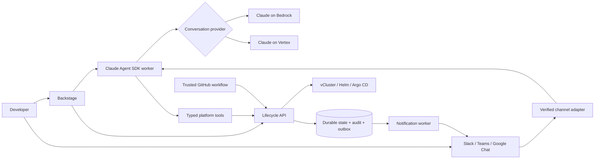

# Architecture and trust boundaries

The lifecycle API owns environment state. Backstage, chat, and CI are clients of that API; the LLM cannot grant permissions or bypass its checks.

## Durable state

The lifecycle engine uses bbolt transactions on a persistent volume and a single active process. Kubernetes deployments use one replica and Recreate; do not scale this deployment horizontally. bbolt rejects a second writer. Workers run independent environments concurrently, with one active operation per environment. On restart, interrupted operations are requeued and reconcile through idempotent Helm/Kubernetes operations. Environment generations protect actions against stale state. Expiry reconciliation runs each second; failed cleanup retries hourly. A deletion supersedes a running deployment and cancels its process before teardown.

This is a deliberate initial implementation constraint: controller/database HA and distributed workers are not implemented. Back up the lifecycle volume and retain it outside preview namespaces. Agent sessions likewise require a single writer per conversation; the shipped agent deployment is one replica.

## Auth

Direct API users authenticate through configured OIDC issuer/audience. Local development uses a random token and a loopback-only listener. Trusted Backstage/chat/CI gateways use a service token and a server-validated subject mapping. `X-Stack-Subject` is never accepted without the service credential. Keep `/internal/*` inaccessible to public ingress; only expose the three `/chat/*` paths externally. Service credentials must be rotated and stored through an external secret store.

Subjects and team roles are currently explicit configuration. Account linking connects a verified Slack/Teams/Google identity to that subject through a short-lived, single-use code from an authenticated portal session. Automatic GitHub organization membership synchronization is not yet implemented; remove/update mappings and restart the service to revoke access. The server rechecks mappings on every request.

The agent subprocess does not inherit lifecycle or chat secrets. Shell/file tools and configuration auto-loading are disabled. It receives only typed tools, scoped to the user's identity; tool output is untrusted. Basic secret-pattern redaction is not a data-loss-prevention guarantee. Avoid sending credential-bearing application logs to inference.

## Preview isolation

Host-side NetworkPolicies restrict preview traffic to its namespace, DNS, the gateway, and the virtual control plane's host API connection. Cilium has a dedicated API-server entity rule. The cloud adapter must enforce NetworkPolicy (GKE Dataplane V2; enable EKS VPC CNI policy support or install Cilium before accepting previews).

The admission baseline forbids privileged/host-access pods; it applies to control planes and workloads without spoofable label exclusions. Sample workload containers use the restricted security posture. Shared-node vClusters are intended for trusted internal teams, not hostile multi-tenant workloads. Fork workloads require a separate approved isolation workflow.

## Provider binding

Both Bedrock and Vertex are supported by the Claude Agent SDK. Set model IDs explicitly because availability depends on region and account. Provider choice is recorded in session metadata; switching provider requires a new conversation. No request silently falls back to a different cloud. Workload identities stay in the runtime; only authorized context goes to managed Claude inference.

## Delivery semantics

Lifecycle actions are durable. Chat messages are deduplicated on disk; a process crash after receipt does not automatically re-execute an uncertain action. Users must check the operation record before retrying. Notification outbox delivery is at least once; a provider accepting a message before an acknowledgement is recorded can produce a duplicate. Expired or superseded pending notifications are cancelled. No production messaging or inference is performed by unit tests.
